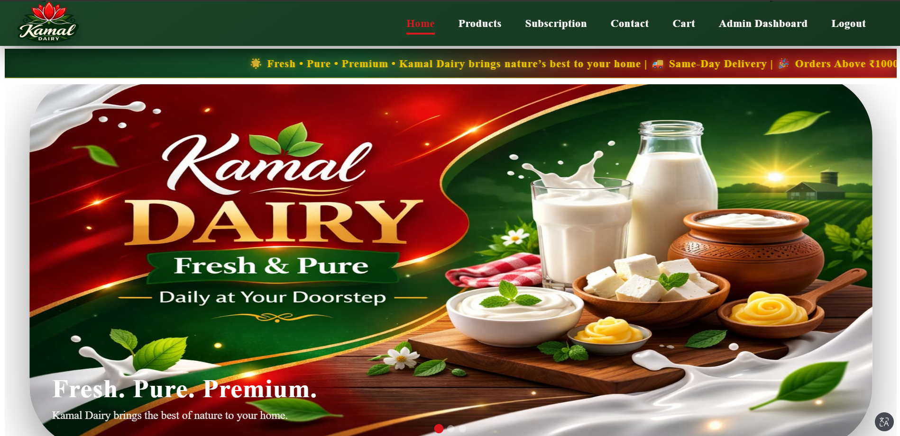
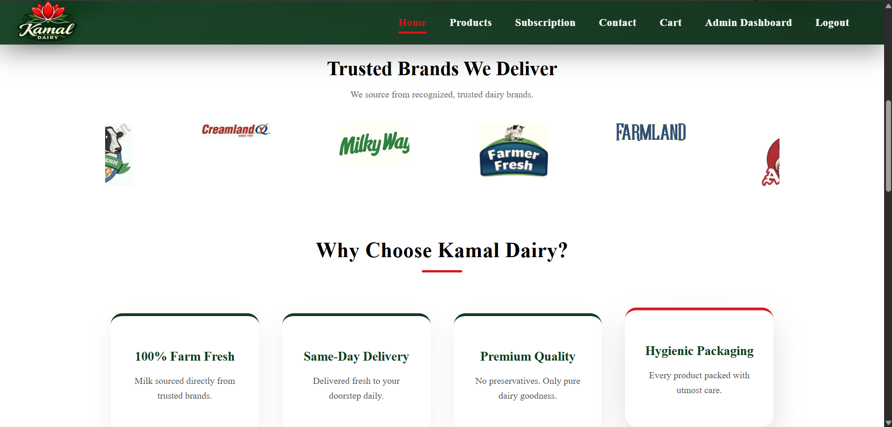
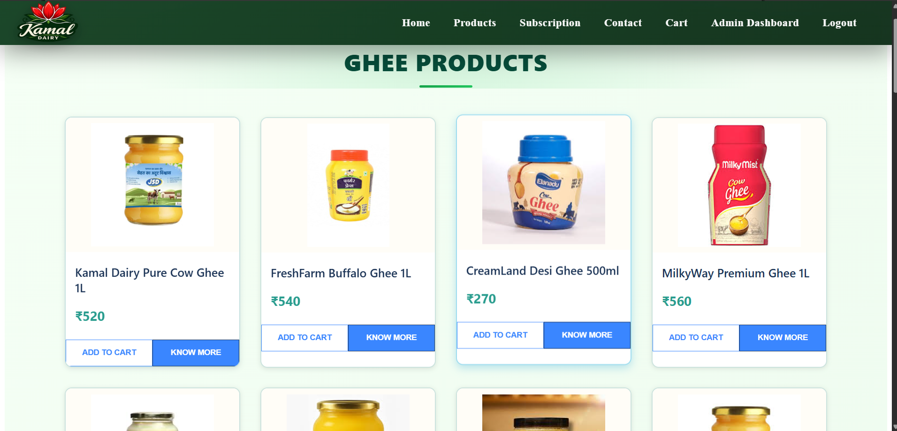
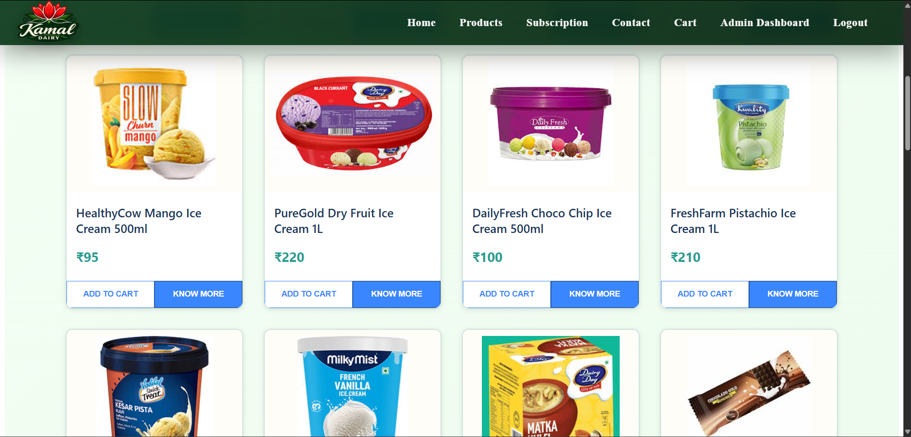
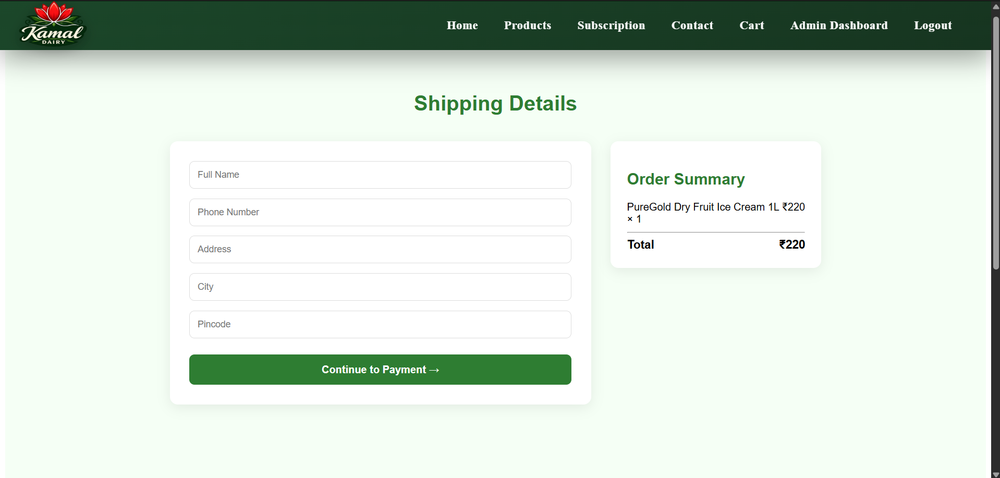
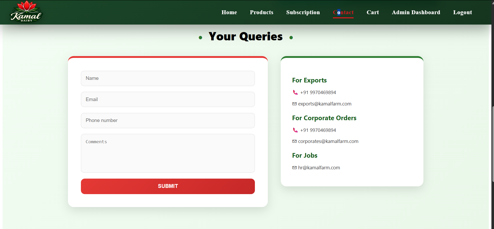
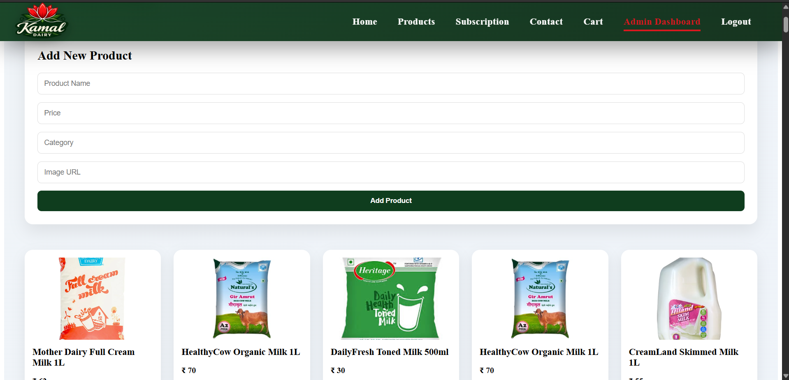

🥛 Kamal Dairy - Frontend

🚀 This project was developed as part of my Internship Project, where I built and deployed a full-stack dairy management application.

A modern, scalable, and responsive React-based web application designed to manage dairy product subscriptions, customer interactions, and online ordering.

---

📌 Project Overview

Kamal Dairy is a full-stack application where the frontend is built using React and communicates with a Spring Boot backend via REST APIs. The application is deployed on AWS EC2 and served using Nginx.

This project demonstrates real-world concepts such as:

- Full-stack development during internship
- Frontend-backend integration
- Cloud deployment (AWS EC2)
- REST API communication
- Authentication handling
- Production-level hosting

---

🚀 Features

🛒 Product Management

- Browse dairy products (milk, curd, paneer, etc.)
- View detailed product information
- Explore trending products

🔐 Authentication

- User signup and login functionality
- Secure authentication flow

🛍️ Cart System

- Add items to cart
- Remove items from cart
- View cart summary

📦 Subscription System

- Daily / Weekly / Monthly subscriptions

💳 Order Processing

- Checkout functionality
- Order placement

📞 Contact System

- Contact form for user queries

🧑‍💼 Admin Features

- Admin dashboard (if implemented)
- Product management

📱 Responsive Design

- Mobile-friendly UI
- Optimized for all screen sizes

---

🛠️ Tech Stack

Frontend

- React.js
- JavaScript (ES6+)
- HTML5 & CSS3

Tools & Libraries

- Vite
- Fetch API

Deployment

- AWS EC2
- Nginx
- WinSCP
- PuTTY

---

📂 Project Structure

kamal-dairy-frontend/
│
├── src/
│   ├── components/
│   ├── pages/
│   ├── assets/
│   ├── App.jsx
│
├── public/
├── package.json
└── README.md

---

⚙️ Setup Instructions

git clone <your-frontend-repo>
cd kamal-dairy-frontend
npm install
npm run dev

---

🌐 API Integration

The frontend communicates with backend APIs hosted on AWS EC2.

---

🏗️ Build for Production

npm run build (for frontend)

---

☁️ Deployment (AWS EC2 + Nginx)

1. Build project using "npm run build"
2. Upload "dist" folder using WinSCP
3. Move files to "/var/www/html"
4. Start Nginx:
   sudo systemctl start nginx
5. Access:
   https://kamaldairy.online

---

🌐 Live Demo

https://kamaldairy.online

---

## 📸 Screenshots

### 🏠 Home Page

### 🛒 Products Page

### 🛍️ Cart Page

.png)

### 📞 Contact Page

### 🧑‍💼 Admin Dashboard

---

💡 Key Highlights

- Developed during internship with real-world deployment
- Full-stack integration using React and Spring Boot
- Deployed on AWS EC2 using Nginx
- Handled CORS and API communication issues
- Optimized backend using swap memory

---

🧠 Learnings

- Real-world full-stack development experience
- AWS EC2 deployment and server management
- Debugging production-level issues
- Understanding system performance and memory optimization

---

🚀 Future Improvements

- Add HTTPS (SSL)
- Use custom domain
- Add payment gateway
- Improve UI/UX

---

👨‍💻 Author

Name : Jayesh Dhamal
Email : jayeshdhamal03@gmail.com
Phone : 9970469894
